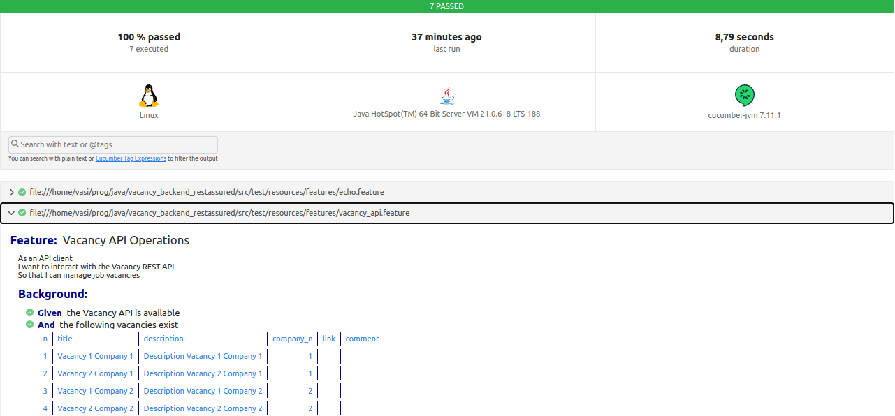
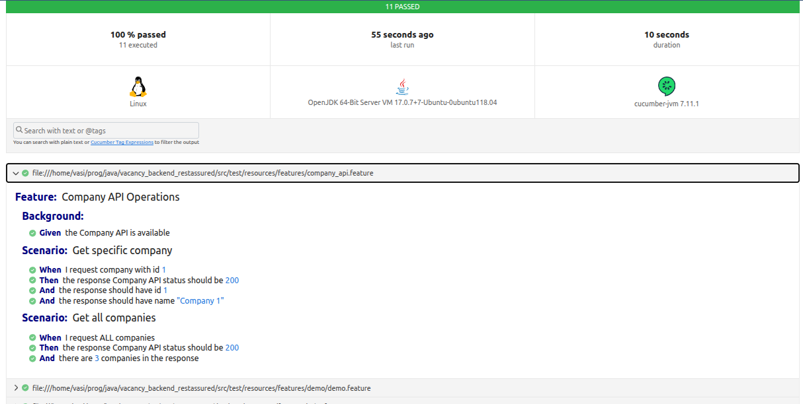
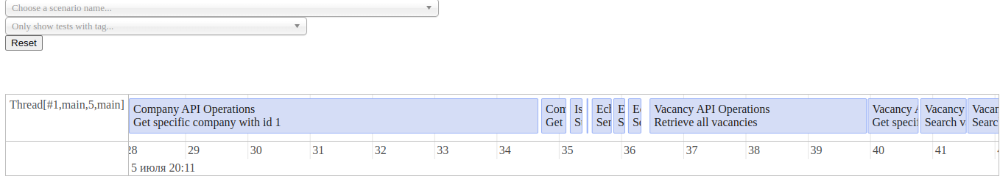
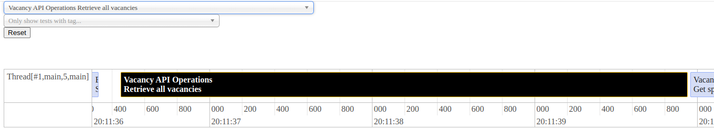
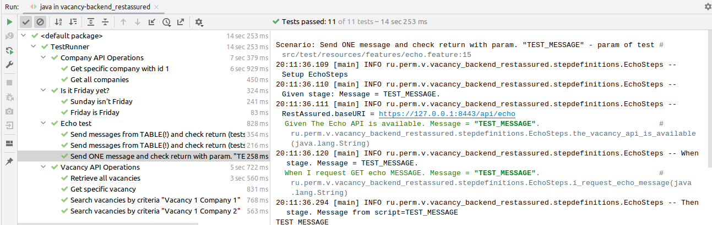

### Rest тесты для проекта vacancy_backend
[vacancy_backend](https://github.com/cherepakhin/family/tree/master/src/main/resources/db/migration)

Перед проведением тестов запустить проект [vacancy_backend](https://github.com/cherepakhin/family/tree/master/src/main/resources/db/migration).

Адрес backend указан в [ru.perm.v.vacancy_backend_restassured.stepdefinitions.Setting](src/test/ru/perm/v/vacancy_backend_restassured/stepdefinitions/Setting.java)

````java
String BASE_URL = "http://127.0.0.1:8090/api";
````

### Используется RestAssured и Cucumber

С помощью RestAssured делаются HTTP-запросы. С помощью Cucumber общая оршанизация тестов и получение отчетов.

Проведение тестов:

````shell
./mvnw test
````

Отчеты в target/cucumber-reports/cucumber.html





Отчет о времени провежении тестов в target/test-results/timeline/index.html

Вид в Idea:


Cucumber для Before, Given, Then, When:

````java
import io.cucumber.java.Before;
import io.cucumber.java.en.Given;
import io.cucumber.java.en.Then;
import io.cucumber.java.en.When;

....

@Given("Given. the Echo API is available. Message = {string}.") // string - указать тип
public void the_vacancy_api_is_available(String message) {
    ....
}

@When("When. I request GET echo MESSAGE. Message = {string}.")
public void i_request_echo_message(String message) {
    ....
}

@Then("Status OK.")
public void statusOk() {
    ....
}

````

RestAssured для request, response

````java
    @When("When. I request GET echo MESSAGE. Message = {string}.")
    public void i_request_echo_message(String message) {
        logger.info("When stage. Message = " + message + ".");
        response = request.get("/"+ message);
    }

    @Then("Status OK.")
    public void statusOk() {
        logger.info("Then stage");
//        assert "aaa".equals("bbb"); // example bad test
        assert response.getStatusCode() == 200;
    }

````

### Ручные тесты с помощью httpie

````shell
$ https -v https://v.perm.ru:8443/api/echo/aaa
````

### HTTPS

Установить параметр __RestAssured.useRelaxedHTTPSValidation()__.

Настройка:

````java
@Given("The Echo API is available. Message = {string}.") // string - указать тип
public void the_vacancy_api_is_available(String message) {
    logger.info("Given stage: Message = " + message + ".");
    RestAssured.baseURI = Setting.BASE_URL + "/echo";
    logger.info("RestAssured.baseURI = " + RestAssured.baseURI);
    RestAssured.useRelaxedHTTPSValidation(); // SKIP SSL VERIFY !!!!
    request = given()
            .header("Content-Type", "text/plain");
}
````

(см. [EchoSteps.java](src/test/ru/perm/v/vacancy_backend_restassured/stepdefinitions/EchoSteps.java))

### Ссылки

- [https://cucumber.io/](https://cucumber.io/)
- [Cucumber 10-minute tutorial](https://cucumber.io/docs/guides/10-minute-tutorial/)
- [Integration testing bdd-style](https://www.codecrumbs.dev/posts/cucumber-integration-tests/)
